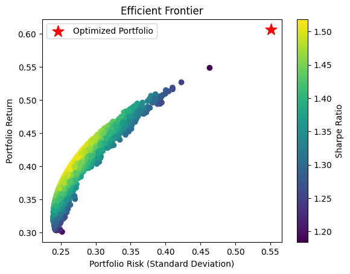

# portfolio_optimization
# 📈 Markowitz Mean-Variance Portfolio Optimization

This project implements portfolio optimization using historical stock data for AAPL, MSFT, and TSLA.  
The goal is to maximize return for a given level of risk by identifying the optimal asset allocation.

## 🔑 Key Highlights
- Calculated expected returns, volatilities, and correlations
- Generated 20,000 random portfolios
- Plotted the Efficient Frontier and identified the Sharpe-optimal portfolio
- Used Python, NumPy, pandas, matplotlib, and yfinance

## 📊 Output

---
---

📝 **Note**: This project was created as part of my learning process using guidance from AI
All code was run, tested, and understood by me. I’m continuing to grow in my data science and machine learning journey.

